### Deep Learning (딥 러닝)

- 인공 신경망 (Artificial Neural Network)의 층을 연속적으로 깊게 쌓아올려 데이터를 학습하는 방식이다.
- 인간이 학습하고 기억하는 매커니즘을 모방한 기계 학습이다.

- 인간은 학습할 때 뇌에 있는 뉴런이 자극을 받아들이며, 자극이 일정 수준 이상이 되면  
  화학 물질을 통해 다른 뉴런과 연결되며 해당 부분이 발달한다.
- 자극이 약하거나 기준치를 넘지 못하면 뉴런은 연결되지 않는다.
- 입력한 데이터가 활성 함수에서 임계점을 넘으면 출력된다.

- 초기 인공 신경망(Perceptron)에서 깊게 층을 쌓아 학습하는 딥 러닝으로 발전한다.
- 딥 러닝은 Input Nodes Layer, Hidden Nodes Layer, Output Nodes Layer의 세 가지 층이 존재한다.

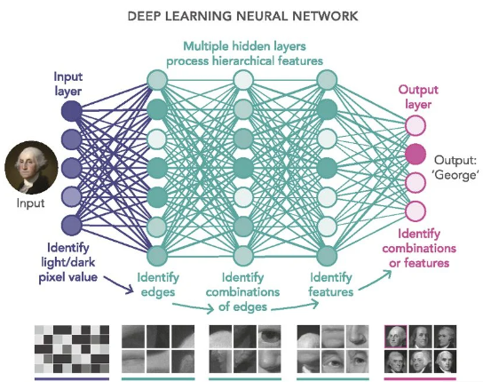

 

---

 

### SLP (Single Layer Perceptron, 단층 퍼셉트론, 단일 퍼셉트론)

- 가장 단순한 형태의 신경망으로서, Hidden Layer가 없고 Single Layer로 구성되어 있다.
- 퍼셉트론의 구조는 입력 feature와 가중치, Activation Function, 출력 값으로 구성되어 있다.
- 퍼셉트론에서의 가중치는 신경 세포에서 신호를 전달하는 축삭 돌기의 역할을 하며,  
  입력 값과 가중치는 모두 인공 뉴런(활성 함수)으로 도착한다.

- 가중치가 클수록 해당 입력 값이 중요하다는 뜻이고,  
  인공 뉴런(활성 함수)에 도착한 각 입력 값과 가중치를 곱한 뒤, 그것들의 총 합을 구한다.
- 인공 뉴런(활성 함수)은 보통 시그모이드 함수와 같은 계단 함수를 사용하며,  
  합계를 확률로 변환하고, 이 때 임계치를 기준으로 0 또는 1을 출력한다.

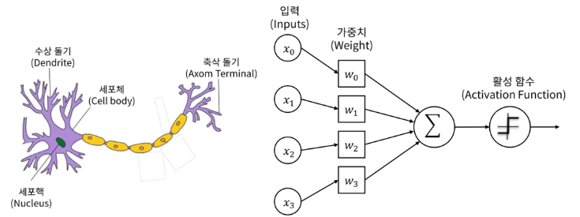

 

- 로지스틱 회귀 모델이 인공 신경망에서는 하나의 인공 뉴런으로 볼 수 있다.
- 결과적으로, 회귀 모델과 마찬가지로 실제 값과 예측 값의 차이가  
  최소가 되는 가중치를 찾는 과정이 퍼셉트론의 학습 과정이다.

- 최초 가중치를 설정한 뒤, 입력 feature 값으로 예측 값을 계산하고,  
  실제 값과의 차이를 구한 뒤 이를 줄일 수 있는 방향으로 가중치를 변경한다.
- 퍼셉트론의 활성화 정도를 편향(bias)으로 조절할 수 있으며, 편향을 통해 어느 정도의 자극을 미리 주고 시작할 수 있다.
- 뉴런이 활성화되기 위해 필요한 자극이 1,000이라고 가정하면, 500의 입력 값만 받아도 편향을 2로 주어 1,000으로 만들 수 있다.

    

        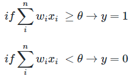
    

    

        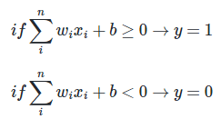
    

 

- 퍼셉트론의 출력 값과 실제 값의 차이를 줄여나가는 방향으로 계속해서 가중치를 변경하며, 이 떄 경사 하강법을 사용한다.

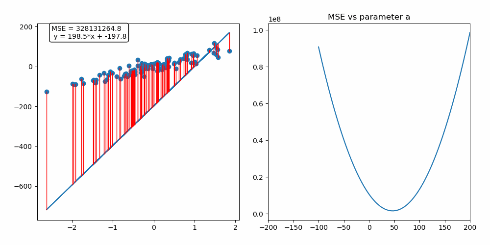

 

---

 

#### SGD (Stochastic Gradient Descent, 확률적 경사 하강법)
- 경사 하강법 방식은 전체 학습 데이터를 기반으로 계산한다.
- 하지만 입력 데이터가 크고 레이어가 많을수록 그만큼 많은 자원이 소모된다.

- 일반적으로 메모리 부족으로 인해 연산이 불가능하기 때문에, 이를 극복하기 위해 SGD 방식이 도입되었다.
- 이는 전체 학습 데이터 중 단 한 건만 임의로 선택하여 경사 하강법을 실시하는 방식을 의미한다.

- 많은 건 수 중에서 한 건만 실시하기 때문에, 빠르게 최적점을 찾을 수 있지만 노이즈가 심하다.
- 무작위로 추출된 샘플 데이터에 대해 경사 하강법을 실시하기 때문에 진폭이 크고 불안정해 보일 수 있다.
- 일반적으로는 사용되지 않으며, SGD을 얘기할 때는 보통 미니 배치 경사 하강법을 의미한다.

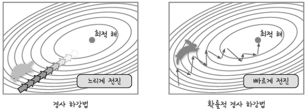

 

---

 

#### Mini-Batch Gradient Descent (미니 배치 경사 하강법)
- 전체 학습 데이터 중, 특정 크기(Batch 크기)만큼 임의로 선택해서 경사 하강법을 실시한다.
- 이것 또한 확률적 경사 하강법이다.

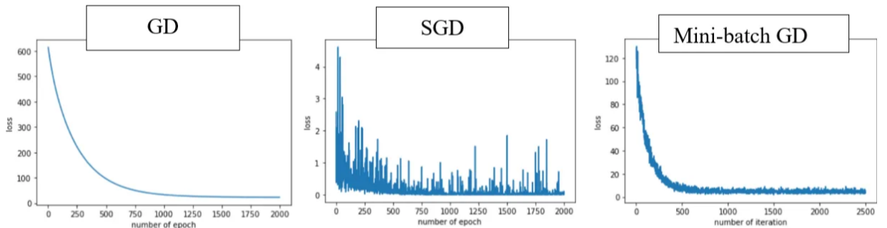

 

- 전체 학습 데이터가 1,000건, bacth size를 100건이라고 가정하면,  
  전체 데이터를 batch size만큼 나눠서 가져온 뒤 섞고, 경사 하강법을 계산한다.
- 이 경우, 10번 반복해야 1,000개의 데이터가 모두 학습되고, 이를 epoch라고 한다.
- 즉, 10 epoch * 100 batch이다.

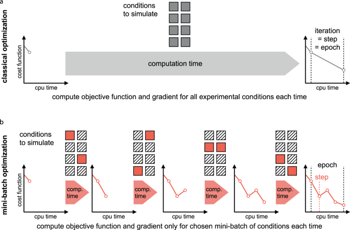

 

---

 

### Multi Layer Perceptron (다층 퍼셉트론, 다중 퍼셉트론)
- 보다 복잡한 문제를 해결하기 위해 입력층과 출력층 사이에 은닉층(Hidden Layer)이 포함되어 있다.
- 퍼셉트론을 여러 층 쌓은 인공신경망으로서, 각 층은 활성 함수를 통해 입력을 처리한다.
- 층이 깊어질수록 보다 정확한 분류가 가능해지지만, 너무 깊어지면 Overfitting이 발생한다.

    

        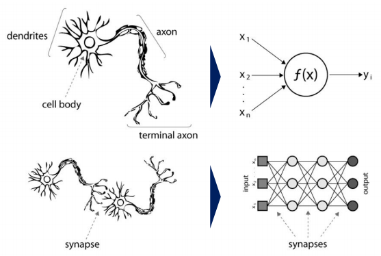
    

    

        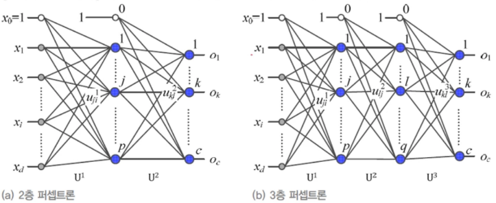
    

 

---

 

### Activation Function (활성화 함수)
- 인공 신경망에서 입력값에 가중치를 곱한 뒤 전부 합한 결과를 적용하는 함수다.

 

1. 시그모이드 함수
    - 은닉층이 아닌 최종 활성화 함수, 출력층에서 사용한다.
    - 은닉층에서 사용 시, 입력값이 양 또는 음의 방향으로 큰 값일 경우 출력에 변화가 없다.
    - 평균이 0이 아니기 때문에 정규 분포 형태가 아니며,  
      방향에 따라 기울기가 달라져서 탐색 경로가 비효율적인(지그재그) 형태가 된다.

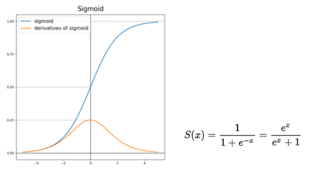

 

2. 소프트맥스 함수
   - 마찬가지로 은닉층이 아닌 최종 활성화 함수(출력층)에서 사용한다.
   - 시그모이드와 유사하게 0 ~ 1 사이의 값을 출력하지만,  
     이진 분류가 아닌 다중 분류를 통해 모든 확률 값이 1이 되도록 해준다.
   - 여러 개의 타겟 데이터를 분류하는 다중 분류의 최종 활성화 함수(출력층)로 사용된다.

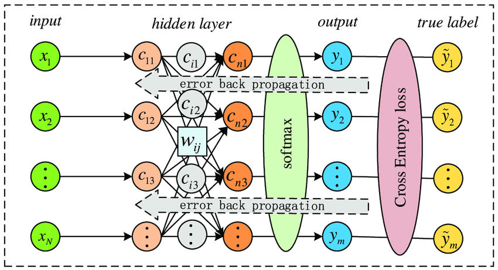

 

3. 탄젠트 함수
   - 은닉층이 아닌 최종 활성화 함수(출력층)에서 사용한다.
   - 은닉층에서 사용 시, 시그모이드와 달리 -1 ~ 1 사이의 값을 출력해서 평균이 0이 될 수 있지만,  
     여전히 입력 값이 양 또는 음의 방향으로 큰 값일 경우 출력 값의 변화가 미비하다.

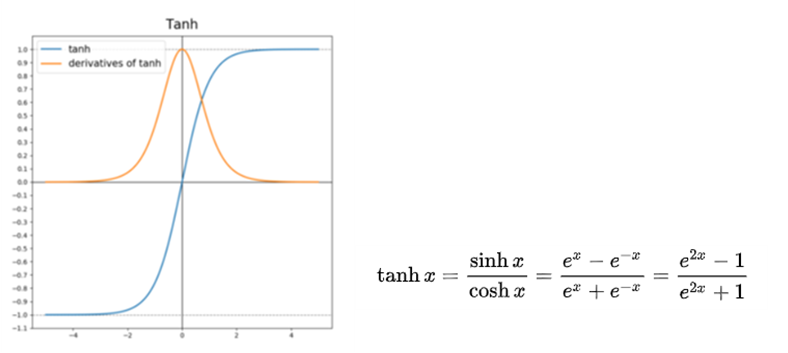

 

4. 렐루 함수
   - 대표적인 은닉층의 활성 함수다.
   - 입력 값이 0보다 작으면 0을, 0보다 크면 입력 값을 그대로 출력하게 된다.
  
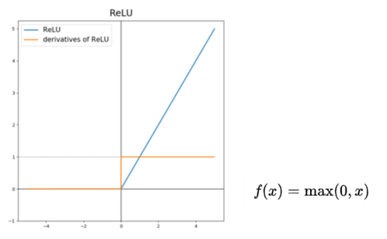

 

---

 

### optimizer (최적화)
- 최적의 경사 하강법을 적용하기 위해 필요하며, 최소값을 찾아가는 방법들을 의미한다.
- loss를 줄이는 방향으로 최소 loss를 보다 빠르고 안정적으로 수렴할 수 있어야 한다.

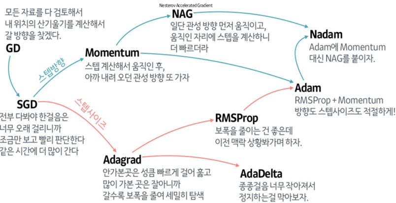

 

#### Momentum
- 가중치를 업데이트할 때마다 이전 값을 일정 수준 반영시키면서 새로운 가중치로 업데이트한다.
- 지역 최소값에서 벗어나지 못하는 문제를 해결할 수 있으며,  
  진행했던 방향만큼 추가적으로 더해서 관성처럼 빠져나올 수 있게 해준다.

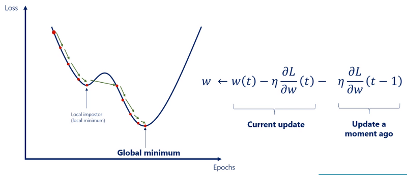

 

#### AdaGrad (Adaptive Gradient)
- 가중치 별로 서로 다른 학습률을 동적으로 적용한다.
- 변화가 적은 가중치에는 보다 큰 학습률을 적용하고, 변화가큰 가중치에는 보다 작은 학습률을 적용한다.
- 처음에는 큰 보폭으로 이동하다가, 최소값에 가까워질수록 작은 보폭으로 이동한다.
- 과거의 모든 기울기를 사용하기 때문에 학습률이 급격히 감소하며, 분모가 커짐으로써 학습률이 0에 가까워진다.

    

        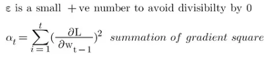
    

    

        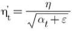
    

 

#### RMSProp (Root Mean Square Propagation)
- AdaGrad의 단점을 보완한 기법으로서, 학습률이 지나치게 작아지는 것을 막기 위해  
  지수 가중 평균법(Exponential Weighted Averages)을 통해 구한다.
- 지수 가중 평균법이란, 데이터의 이동 평균을 구할 때  
  오래된 데이터가 미치는 영향을 지수적으로 감쇠하도록 하는 방법이다.
- 이전의 기울기들을 똑같이 더해가는 것이 아니라,  
  훨씬 이전의 기울기는 약간만 반영하고, 최근의 기울기는 보다 많이 반영한다.
- feature마다 적절한 학습률을 적용하여 학습을 효율적으로 진행할 수 있고, AdaGrad보다 학습을 오래 할 수 있다.

 

#### Adam (Adaptive Moment Estimation)
- Momentum과 RMSProp, 두 가지 방식을 결합한 형태로,  
  진행하던 속도에 관성을 주고 지수 가중 평균법을 적용한 알고리즘이다.
- 가장 많이 사용되는 최적화 알고리즘으로, 수식은 아래와 같다.

    

        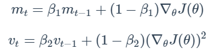
    

    

        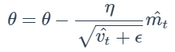
    

 

---

 

### TensorFlow (텐서플로우)
- 구글이 개발한 오픈소스 소프트웨어 라이브러리이며,  
  머신러닝과 딥러닝을 쉽게 사용할 수 있도록 다양한 기능을 제공한다.
- 주로 이미지 인식이나 반복 신경망 구성, 기계 번역, 필기 숫자 판별 등을 위한 각종 신경망 학습에 사용된다.
- 딥러닝 모델을 만들 때, 기초부터 세세하게 작업해야 하기 때문에 진입장벽이 높다.

 

### Keras (케라스)
- 일반 사용 사례에 "최적화, 간단, 일관, 단순화" 된 인터페이스를 제공한다.
- 손쉽게 딥러닝 모델을 개발하고 활용할 수 있도록 직관적인 API를 제공한다.
- Tensorflow 2버전 이상부터 Keras가 포함되어 있기 때문에, Tensorflow를 통해 사용한다.
- 이제는 기존 Keras 패키지보다 Tensorflow에 내장된 Keras를 사용하는 것이 권장된다.

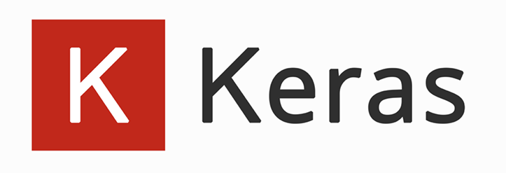

 

### Grayscale, RGB
- 흑백 이미지와 컬러 이미지는 각각 2차원과 3차원으로 표현될 수 있다.
- 흑백 이미지는 0 ~ 255 사이의 값을 가지는 2차원 배열 (높이 * 너비)이고,  
  컬러 이미지는 R, G, B 라는 2차원 배열 3개를 가지는 3차원 배열 (높이 * 너비 * 채널)이다.

    

        
    

    

        
    

 

### Grayscale Image Matrix
- 검은색에 가까운 색은 0에, 흰색에 가까운 색은 255에 가깝다.
- **모든 픽셀이 feature다.**

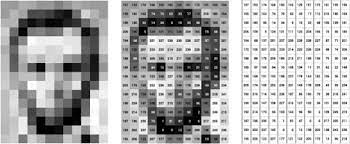

 

---

 

### Sequential API, Functional API

#### Sequential API
- 간단한 모델을 구햔하기에 적합하며, 단순하게 층을 쌓는 방식으로 쉽고 간단하게 사용할 수 있다.
- 단일 입력 및 출력만 있기 때문에, 레이어를 공유하거나 여러 입력 또는 출력을 가질 수 있는 모델은 생성할 수 없다.

#### Functional API
- Sequential API로는 구현하기 어려운 복잡한 모델들을 구현할 수 있다.
- 여러 개의 입력 또는 출력을 가지는 모델을 구현하거나 층 간의 연결 및 연산을 수행하는 모델 구현 시 사용한다.

#### 성능 평가
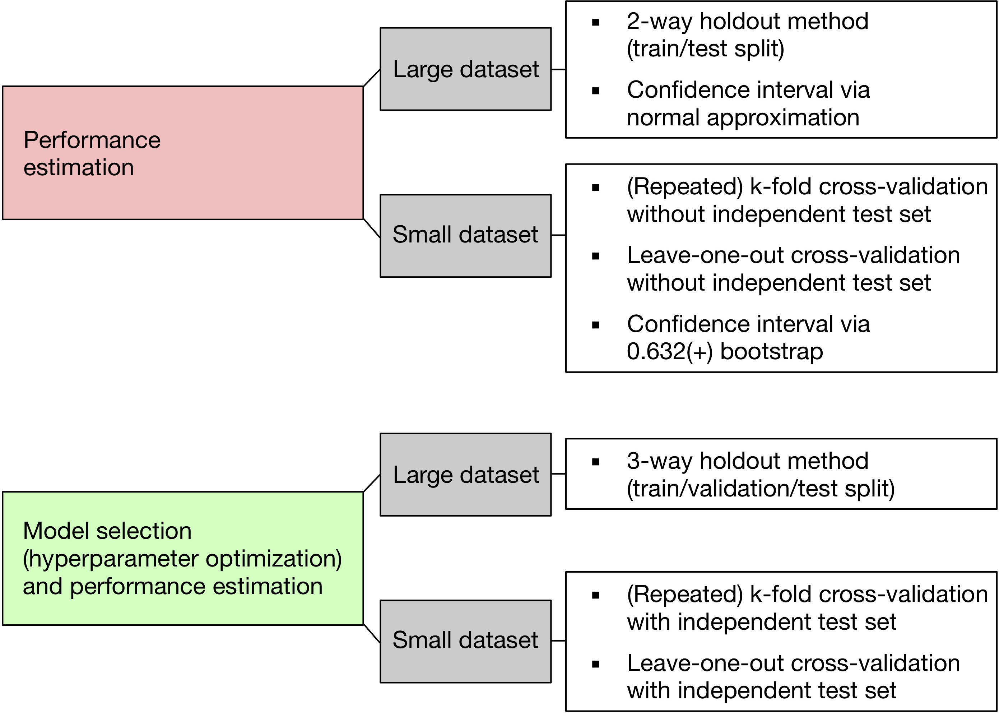
